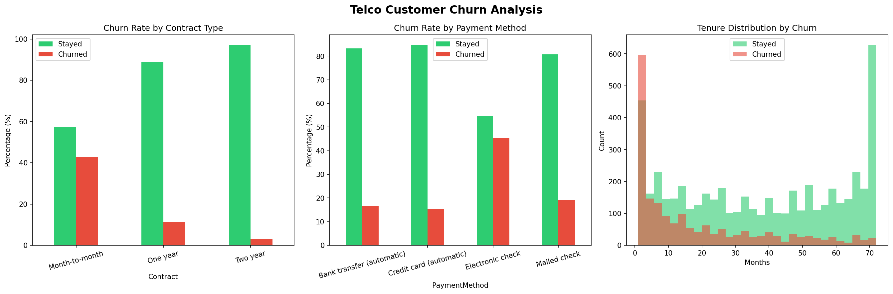

# 📱 Telco Customer Churn Analysis

Analysis of 7,043 telecom customers to identify key drivers of customer churn.

---

## 🎯 Business Problem

The company loses 26.5% of its customers — nearly 1 in 4.
This analysis identifies who churns, why, and what can be done about it.

---

## 🔍 Key Findings

- **Contract type** is the strongest retention factor: month-to-month customers
  churn at 42.7% vs only 2.8% for two-year contracts
- **Electronic check** users churn at 45.3% — nearly 3x higher than
  automatic payment methods
- **Churned customers pay more** on average ($74/mo vs $61/mo),
  suggesting price-value mismatch
- **Early months are critical**: most churn happens in the first 10 months
- **Senior citizens** churn at 41.7% vs 23.7% — may need tailored plans

---

## 💡 Recommendations

- Incentivize customers to switch from month-to-month to annual contracts
- Encourage automatic payment methods with small discounts
- Introduce loyalty benefits after 12 months
- Create family and senior-friendly plans

---

## 🛠 Tools

Python (pandas, Matplotlib, Seaborn) · Jupyter Notebook

---

## 📸 Analysis Preview

